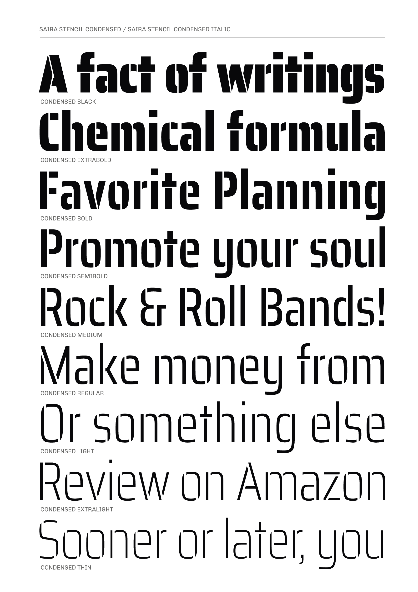
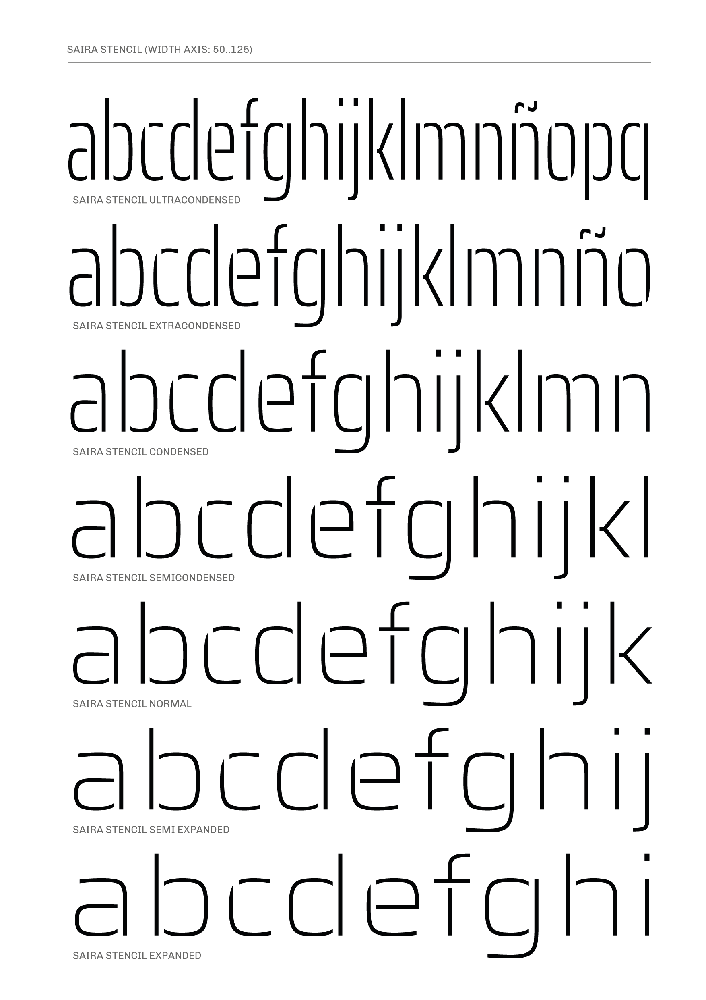

# Saira Stencil family

**Gatti & Omnibus-Type Team**
*SIL Open Font License 1.1,*
*72 fonts, 885 glyphs each variant (Press Series).*
*Tipos Latinos 2014*

Saira Stencil is the incisive variant of the Saira typeface family. It retains the core structure of its predecessor but is defined by the strategic addition of precise cuts—some logically placed, others deliberately offbeat. This intervention creates a typeface that is both sharp and visually striking, making it an optimal choice for titles, branding, and logotypes where a bold, memorable impression is required. It was designed by Héctor Gatti and developed by the Omnibus-Type Team.

Saira is a contemporary sans serif system, a versatile family of 126 styles (9 different weight variants, in 7 widths, plus matching italics.) It is part of the Press Series, for it is applicable in newspapers, magazines, books and websites. Showing high adaptability, it can be used in headlines and long texts. The original masters were designed by Héctor Gatti. The character sets were later completed by the Omnibus-Type Team.

#### Saira Stencil Family contains:

* Ultracondensed Thin/Ultracondensed Thin Italic
* Ultracondensed ExtraLight/Ultracondensed Extralight Italic
* Ultracondensed Light/Ultracondensed Light Italic
* Ultracondensed Regular/Ultracondensed Italic
* Ultracondensed Medium/Ultracondensed Medium Italic
* Ultracondensed SemiBold/Ultracondensed SemiBold Italic
* Ultracondensed Bold/Ultracondensed Bold Italic
* Ultracondensed ExtraBold/Ultracondensed ExtraBold Italic
* Ultracondensed Black/Ultracondensed Black Italic

* Extracondensed Thin/Extracondensed Thin Italic
* Extracondensed ExtraLight/Extracondensed Extralight Italic
* Extracondensed Light/Extracondensed Light Italic
* Extracondensed Regular/Extracondensed Italic
* Extracondensed Medium/Extracondensed Medium Italic
* Extracondensed SemiBold/Extracondensed SemiBold Italic
* Extracondensed Bold/Extracondensed Bold Italic
* Extracondensed ExtraBold/Extracondensed ExtraBold Italic
* Extracondensed Black/Extracondensed Black Italic

* Condensed Thin/Condensed Thin Italic
* Condensed ExtraLight/Condensed Extralight Italic
* Condensed Light/Condensed Light Italic
* Condensed Regular/Condensed Italic
* Condensed Medium/Condensed Medium Italic
* Condensed SemiBold/Condensed SemiBold Italic
* Condensed Bold/Condensed Bold Italic
* Condensed ExtraBold/Condensed ExtraBold Italic
* Condensed Black/Condensed Black Italic

* SemiCondensed Thin/SemiCondensed Thin Italic
* SemiCondensed ExtraLight/SemiCondensed Extralight Italic
* SemiCondensed Light/SemiCondensed Light Italic
* SemiCondensed Regular/SemiCondensed Italic
* SemiCondensed Medium/SemiCondensed Medium Italic
* SemiCondensed SemiBold/SemiCondensed SemiBold Italic
* SemiCondensed Bold/SemiCondensed Bold Italic
* SemiCondensed ExtraBold/SemiCondensed ExtraBold Italic
* SemiCondensed Black/SemiCondensed Black Italic

* Thin / Thin Italic
* ExtraLight / ExtraLight Italic
* Light / Light Italic
* Regular / Italic
* Medium / Medium Italic
* SemiBold / SemiBold Italic
* Bold / Bold Italic
* ExtraBold / ExtraBold Italic
* Black / Black Italic

* SemiExpanded Thin/SemiExpanded Thin Italic
* SemiExpanded ExtraLight/SemiExpanded Extralight Italic
* SemiExpanded Light/SemiExpanded Light Italic
* SemiExpanded Regular/SemiExpanded Italic
* SemiExpanded Medium/SemiExpanded Medium Italic
* SemiExpanded SemiBold/SemiExpanded SemiBold Italic
* SemiExpanded Bold/SemiExpanded Bold Italic
* SemiExpanded ExtraBold/SemiExpanded ExtraBold Italic
* SemiExpanded Black/SemiExpanded Black Italic

* Expanded Thin/Expanded Thin Italic
* Expanded ExtraLight/Expanded Extralight Italic
* Expanded Light/Expanded Light Italic
* Expanded Regular/Expanded Italic
* Expanded Medium/Expanded Medium Italic
* Expanded SemiBold/Expanded SemiBold Italic
* Expanded Bold/Expanded Bold Italic
* Expanded ExtraBold/Expanded ExtraBold Italic
* Expanded Black/Expanded Black Italic

To contribute to the project contact [Omnibus-Type](http://omnibus-type.com/).

### Designers

* Héctor Gatti

### License

Copyright (c) 2026, Omnibus-Type (www.omnibus-type.com | omnibus.type@gmail.com)

Licensed under the [*SIL Open Font License, 1.1*](http://scripts.sil.org/OFL); you may not use this file except in compliance with the License.

======
## FONTLOG for the Saira fonts

This file provides detailed information on the Saira font software.  
This information should be distributed along with the Saira fonts and any derivative works.

### Saira is a typeface family that supports the following Unicode language range: 

* Basic Latin 			U+0020-U+007E
* Latin-1 Supplement 		U+00A0-U+00FF
* Latin Extended-A 		U+0100-U+017F
* Latin Extended Additional*	U+1E00-U+1EFF *(111/256)

**Character map to support MS Codepages:**
* 1252 Latin-1
* 1250 Latin-2 (Easter Europe)
* 1254 Turkish
* 1257 Windows Baltic
* 1258 Vietnamese
* Mac Roman

*To contribute to the project contact Omnibus-Type at omnibus.type@gmail.com*

**2026 March 13 (v1.001) Configuring axes (Omnibus-Type)**
- New variable font
- Mastering for Variable fonts

**2018 October 29 (v1.003)**
- Updated to GF Latin Plus set
- Supports 218 Latin languages used in 212 countries

**2018 May 21 (v1.001) Checking names**
- Deleted Custom Parameter Names

**2018 Apr 30 (v1.000) Initial Commit**
- Initial Commit

### Acknowledgements

If you make modifications be sure to add your name (N), email (E), web-address
(if you have one) (W) and description (D). This list is in alphabetical order.

**N:** **Héctor Gatti**  
**E:** omnibus.type@gmail.com  
**W:** http://www.omnibus-type.com  
**D:** Designer

**N:** **Oscar Guerrero Cañizares**  
**E:** omnibus.type@gmail.com  
**W:** http://www.omnibus-type.com  
**D:** Typeface development

**N:** **Eduardo Rodríguez Tunni**  
**E:** omnibus.type@gmail.com  
**W:** http://www.omnibus-type.com  
**D:** Typeface development

**N:** **Pablo Cosgaya**  
**E:** omnibus.type@gmail.com  
**W:** http://www.omnibus-type.com  
**D:** Typeface development

**N:** **Nicolás Silva Schwarzenberg**  
**E:** nsilva.design@gmail.com  
**W:** http://www.omnibus-type.com  
**D:** Typeface development  

**N:** **Yorlmar Campos**  
**E:** omnibus.type@gmail.com  
**W:** http://www.omnibus-type.com  
**D:** Typeface development
